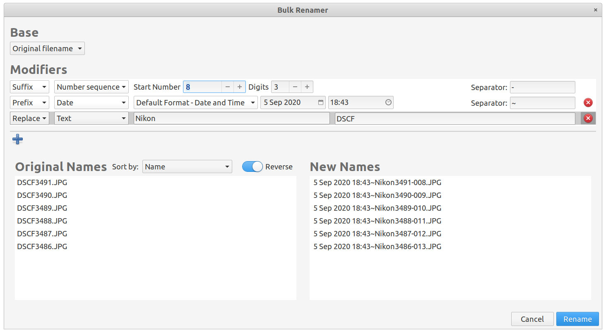

# io.github.jeremypw.bulk-renamer-plugin
A bulk renamer plugin for pantheon-files allowing multiple sequential modifications to the original name or a new constant basename.
 - The modifications may be based on a number sequence, a date-time or text and may appear before or after the current name.
 - text may replace existing text in the name.
 - The modification may be separated from the current name by a user specified separator.
 - The original names may be sorted in several ways before modification.



## Building, Testing, and Installation
As the elementaryos AppCenter does not currently support 3rd party plugins to its native apps it is necessary to build this from
the source code.

You'll need the following packages and their dependencies:
* meson
* valac
* libgranite-dev >= 5.2.0
* libgtk-3-dev
* pantheon-files-core-dev

Run `meson build` to configure the build environment. Change to the build directory and run `ninja` to build

```bash
meson build --prefix=/usr
cd build
ninja
```

You will now find that the context menu in Pantheon Files shows an extra entry when more than one file item
has been selected. Clicking on this option results in the renamer window being launched with the selected files
appearing in the "Old Name" list.
